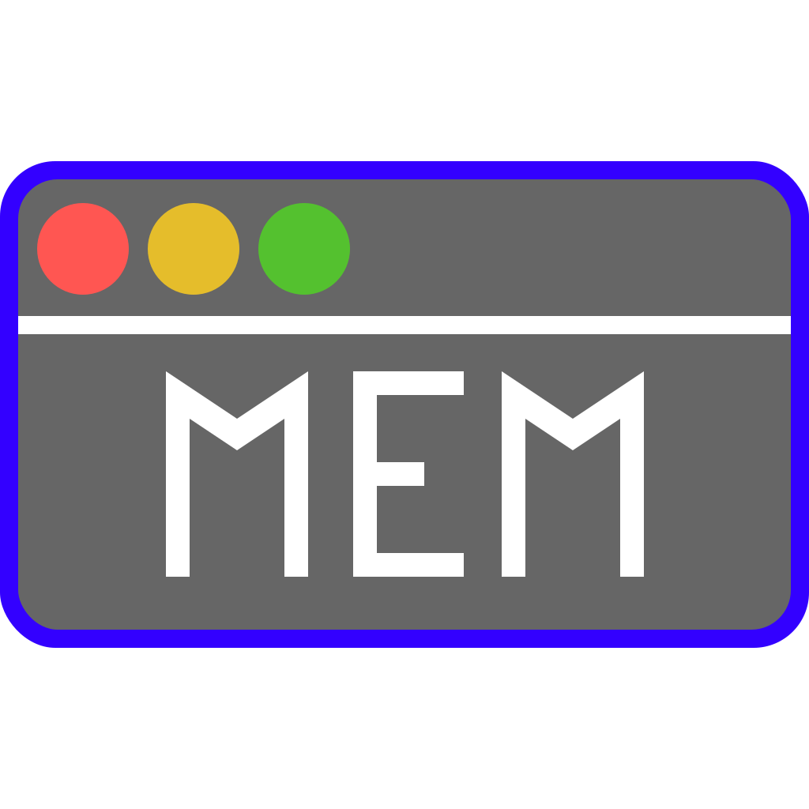
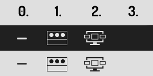

[](#install)
[](https://github.com/relikd/Memmon/releases)
[](https://github.com/relikd/Memmon/releases)



# Memmon

Memmon remembers what your Mac forgets – A simple deamon that restores your window positions on external monitors.

**Limitations:** Currently, Memmon restores windows in other spaces only if the space is activated. If you know a way to access the accessibility settings of a different space, let me know.


## Install

1. You will need macOS 10.10 or newer.
2. Grant Memmon the Accessibility privilege. Go to "System Preference" > "Security & Privacy" > "Accessibility" and add Memmon to that list. Otherwise, you can't move other application windows around and the app has no purpose.
3. Thats it. The app runs in your status bar.


### Status Icon

You can hide the status icon either via `defaults` or the same-titled menu entry. If you do so, the only way to quit the app is by killing the process (with Activity.app or `killall Memmon`). The status icon stays hidden during this execution only. If you restart the OS or app it will reappear (unless you hide the icon with `defaults`).

Memmon has exactly one app-setting, the status icon. You can manipulate the display of the icon, or hide the icon completely:

```sh
# disable status icon completely
defaults write de.relikd.Memmon icon -int 0
# Use window-dots-icon
defaults write de.relikd.Memmon icon -int 1
# Use monitor-with-windows icon (default)
defaults write de.relikd.Memmon icon -int 2
# re-enable status icon and use default icon
defaults delete de.relikd.Memmon icon
```




## FAQ

### Why‽

I am frustrated! Why does my Mac forget all window positions which I moved to a second screen? Every time I unplug the monitor. Every time I close my Macbook lid. Every time I lock my Mac.

Is it macOS 11? Is it the USB-C-to-HDMI converter dongle (notably one made by Apple)? Why do I have to fix things that Apple should have fixed long ago? …


### Aren't there other solutions?

Yes, for example [Mjolnir](https://github.com/mjolnirapp/mjolnir) or [Hammerspoon](https://github.com/Hammerspoon/hammerspoon) (and some comercial ones). But I do not need a full-fledged window manager. Nor the dependencies they rely on. I just need to fix this damn bug.


### What is it good for?

First off, Memmon is less than 300 lines of code – no dependencies. You can audit it in 10 minutes... And build it from scratch – just run `make`.

Secondly, it does one thing and one thing only: Save and restore window positions whenever your monitor setup changes.


### Develop

You can either run the `main.swift` file directly with `swift main.swift`, via Terminal `./main.swift` (`chmod 755 main.swift`), or create a new Xcode project. Select the Command-Line template and after creation replace the existing `main.swift` with the bundled one.
